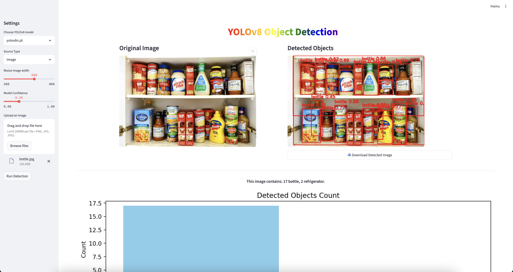

# YOLOv8 Object Detection with Streamlit

This project provides a user-friendly web interface built with Streamlit for real-time object detection using YOLOv8 models. You can upload images or videos to detect objects and visualize the results, including bounding boxes, object descriptions, and charts.



## Features

- **Multiple YOLOv8 Models**: Choose from various YOLOv8 models (`yolov8n.pt`, `yolov8s.pt`, `yolov8m.pt`, `yolov8l.pt`, `yolov8x.pt`).
- **Image and Video Processing**: Supports both image and video uploads for object detection.
- **Adjustable Confidence Threshold**: Fine-tune the model's detection confidence.
- **Interactive UI**: An easy-to-use interface with sliders, buttons, and file uploaders.
- **Downloadable Results**: Download the annotated image with detected objects.
- **Summarized Reports**: For videos, the app provides a summary of all detected objects, including a sample annotated frame and a bar chart of object counts.

## How to Set Up and Run

1.  **Clone the repository:**

    ```bash
    git clone <your-repo-url>
    cd final-project-submission
    ```

2.  **Create and activate a virtual environment (recommended):**

    ```bash
    python -m venv venv
    source venv/bin/activate  # On Windows, use `venv\Scripts\activate`
    ```

3.  **Install the required dependencies:**

    ```bash
    pip install -r requirements.txt
    ```

4.  **Run the Streamlit application:**
    ```bash
    streamlit run app.py
    ```

## How to Use

1.  **Open the application** in your web browser (usually at `http://localhost:8501`).
2.  **Adjust the settings** in the sidebar:
    - **Choose a YOLOv8 model**: Select the model that best suits your needs.
    - **Select the source type**: Choose between "Image" or "Video".
    - **Upload a file**: Upload an image (`.png`, `.jpg`, `.jpeg`) or a video (`.mp4`, `.mov`, `.avi`).
    - **Adjust the model confidence**: Set the confidence threshold for object detection.
3.  **Click "Run Detection"** to process the file.
4.  **View the results**: The app will display the original and annotated image/video frame, along with a description and a chart of the detected objects.
5.  **Download the annotated image** using the download button.
