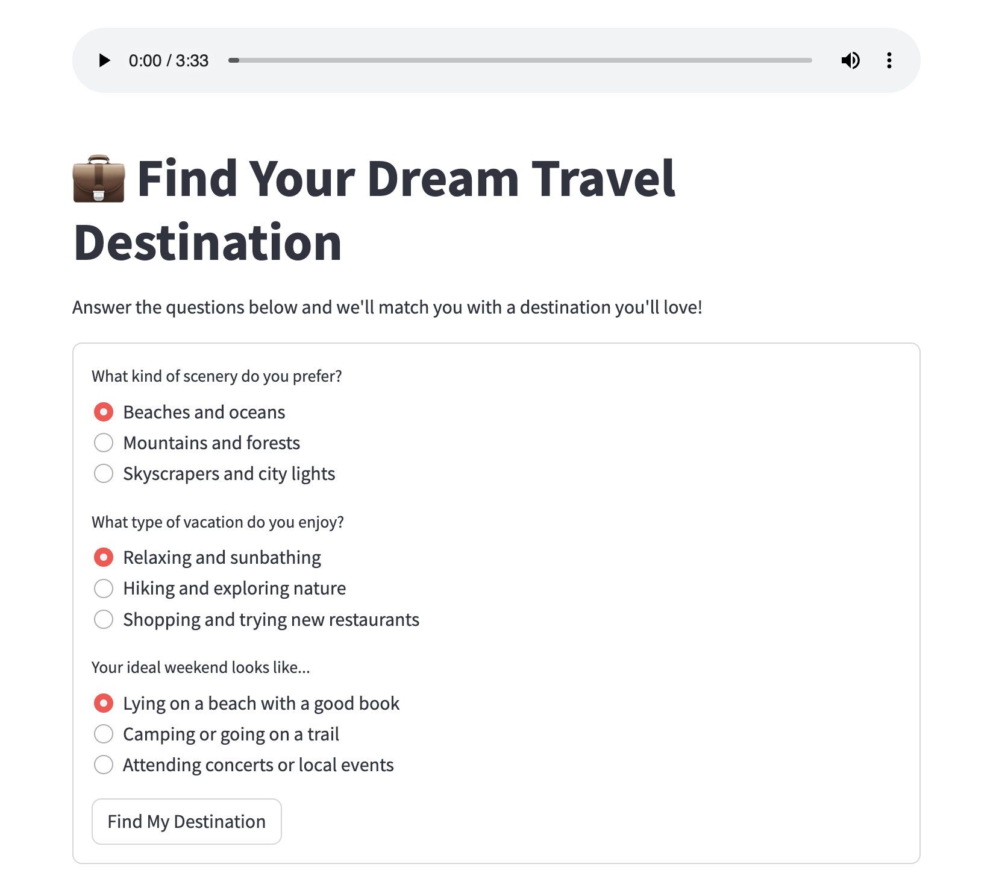

<a name="readme-top"></a>

# Mini Profession Quiz

A fun and interactive web app built with Streamlit that helps you discover which digital profession suits you **Programmer**, **Designer**, or **Data Scientist**—based on your personality and preferences.

---

<details>
  <summary>Table of Contents</summary>
  <ol>
    <li>
      <a href="#about-the-project">About The Project</a>
      <ul>
        <li><a href="#built-with">Built With</a></li>
      </ul>
    </li>
    <li>
      <a href="#getting-started">Getting Started</a>
      <ul>
        <li><a href="#installation">Installation</a></li>
      </ul>
    </li>
  </ol>
</details>

---

## About The Project

<p align="center">
    
</p>

This is a **Mini Quiz App** designed to test what kind of digital profession suits you the most. With fun questions, animated results, and an engaging user interface, it’s a great project to explore personality-based apps using Streamlit.

<p align="right">(<a href="#readme-top">back to top</a>)</p>

### Built With

- 🐍 [Python](https://www.python.org/)
- 📊 [Streamlit](https://streamlit.io/)

<p align="right">(<a href="#readme-top">back to top</a>)</p>

---

## Getting Started

To get a local copy up and running follow these simple steps.

<p align="right">(<a href="#readme-top">back to top</a>)</p>

### Installation

1. Clone the repo:
   ```
   git clone https://github.com/AlviGeo/ai-projects.git
   cd fun-project_1_REAID
   ```
2. Run the apps
   ```
   pip install streamlit
   streamlit run app.py
   open "http://localhost:8501"
   ```

<p align="right">(<a href="#readme-top">back to top</a>)</p>
