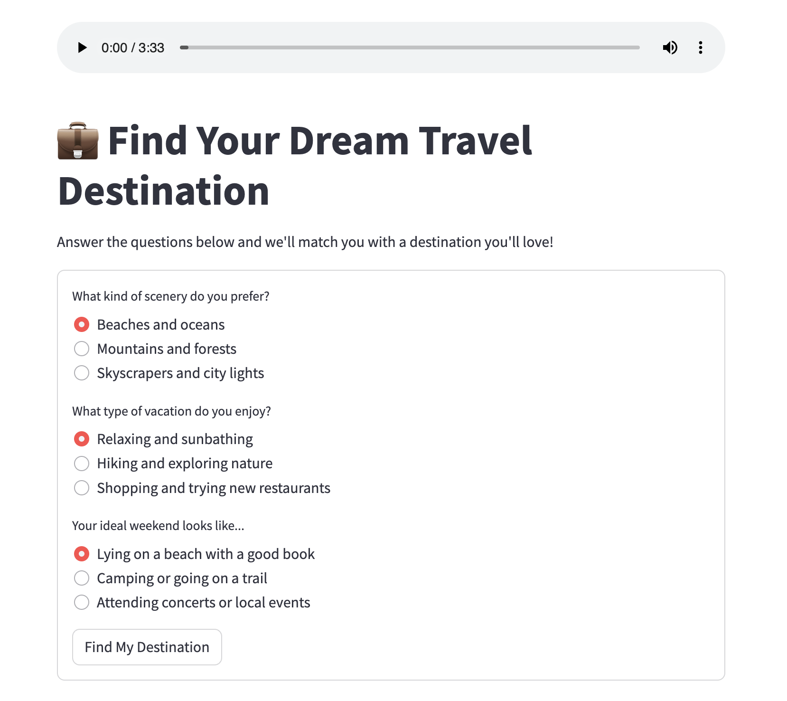

<a name="readme-top"></a>

# 🌍 Find Your Dream Travel Destination

A fun and interactive web app built with Streamlit that helps you discover your ideal travel style — whether you’re a **Beach Lover**, **Nature Explorer**, or **City Wanderer** — based on your personality and preferences.

## 📋 Table of Contents

- [🌍 Find Your Dream Travel Destination](#-find-your-dream-travel-destination)
  - [📋 Table of Contents](#-table-of-contents)
  - [📌 About The Project](#-about-the-project)
    - [✨ Features](#-features)
    - [🛠️ Built With](#️-built-with)
  - [🚀 Getting Started](#-getting-started)
    - [🔧 Installation](#-installation)
  - [📣 Share Your Result](#-share-your-result)
  - [🙌 Credits](#-credits)

## 📌 About The Project

<div align="center">
  
</div>

This is a **Mini Travel Style Quiz App** that helps match you with your dream destination style through fun, thoughtful questions. Whether you crave city lights, peaceful forests, or beach waves — this app figures it out for you in just a few clicks!

### ✨ Features

- 🎵 Background music for immersion
- 🧠 Personality-style quiz with scoring
- 🖼️ Beautiful Unsplash destination images
- 📊 Personalized destination results
- 💬 Custom descriptions for each result
- 📤 Twitter/X share button
- 🎈 Animated feedback and result celebration

### 🛠️ Built With

- [Python](https://www.python.org/)
- [Streamlit](https://streamlit.io/)
- [Unsplash](https://unsplash.com/)

## 🚀 Getting Started

Follow these steps to run the app locally:

### 🔧 Installation

1. Clone the repository:

   ```bash
   git clone https://github.com/AlviGeo/ai-projects.git
   cd fun-project_1_REAID
   ```

2. Install the required package:

   ```bash
   pip install streamlit
   ```

3. Run the app:

   ```bash
   streamlit run app.py
   ```

4. Open your browser and visit:

   ```
   http://localhost:8501
   ```

## 📣 Share Your Result

At the end of the quiz, you'll get a **Twitter/X share link** to let others know your dream travel style! Try it and show off your result 🌴🏙️🏞️

## 🙌 Credits

- App developed by [AlviGeo](https://github.com/AlviGeo)
- Background music hosted on GitHub
- Images sourced from [Unsplash](https://unsplash.com)

<p align="right"><a href="#readme-top">Back to top ⬆️</a></p>
