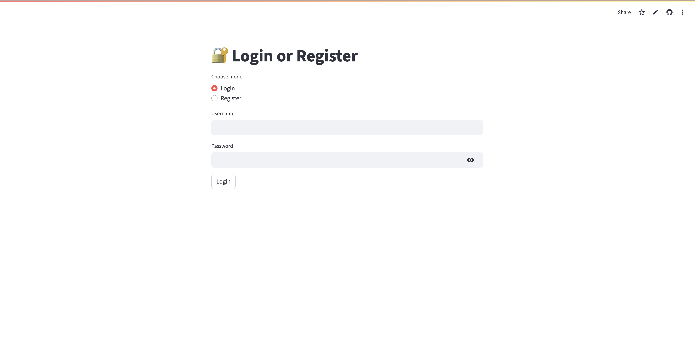
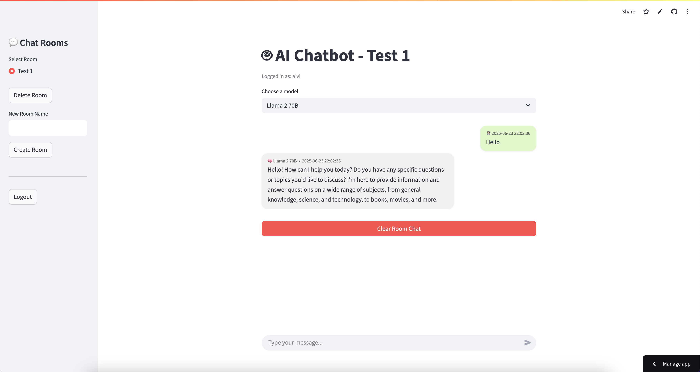

# 🧠 Streamlit Chatbot App with OpenRouter AI

A fully functional chatbot application built using **Streamlit** and powered by **OpenRouter AI**. This app supports user authentication, model switching, API key management, file upload, persistent chat history with SQLite, and a ChatGPT-style user interface.

---

## ✨ Features

- 🔐 **User Login/Register** system with persistent sessions
- 🔑 **API Key input** to chat with model
- 🤖 **Multiple AI model support** (e.g. `gpt-3.5-turbo`, `mistral`, etc.)
- 💬 **Real-time chat interface** with message history
- 🗂️ **Room-based chat** (user-specific sessions)
- 📁 **Image upload support** (shown but not yet processed)
- ⚙️ **Settings section** to update model and API key
- 🧹 **Clear chat history** button
- 🧠 Powered by [OpenRouter.ai](https://openrouter.ai)
- 🧩 Organized in a single `app.py` file for simplicity

---

## 🚀 Getting Started

### 1. Clone the Repository

```bash
git clone https://github.com/AlviGeo/ai-projects
cd fun-project_2_REAID
```

### 2. Install Dependencies

```bash
pip install -r requirements.txt
```

### 3. Run the Application

```bash
streamlit run app.py
```

---

## 🛠️ Configuration

### Get OpenRouter API Key

1. Visit [https://openrouter.ai](https://openrouter.ai)
2. Log in and generate your API key
3. You can enter the API key directly in the app

---

## 📂 Project Structure

```
.
├── app.py                # Main Streamlit application
├── chat_history.db               # SQLite database (auto-generated)
├── requirements.txt      # Python dependencies
├── README.md             # Project documentation
└── images/               # Optional UI screenshots
```

---

## 📷 Screenshots

> Add actual screenshots in the `images/` folder and update links below

| Login Page                          | Chat Interface                |
| ----------------------------------- | ----------------------------- |
|  |  |

---

## 🧱 Tech Stack

- **Frontend/UI**: Streamlit
- **Backend API**: OpenRouter API
- **Database**: SQLite
- **Auth**: Custom auth with password hashing

---

## ⚠️ Security Notes

- Passwords are hashed before storage using SHA-256
- API keys are not saved in the database
- SQLite is used for local development (replaceable with PostgreSQL/MySQL for production)

---

## 📄 License

MIT License. See `LICENSE` for details.

---

## 🙏 Acknowledgements

- [Streamlit](https://streamlit.io/)
- [OpenRouter.ai](https://openrouter.ai/)

---
